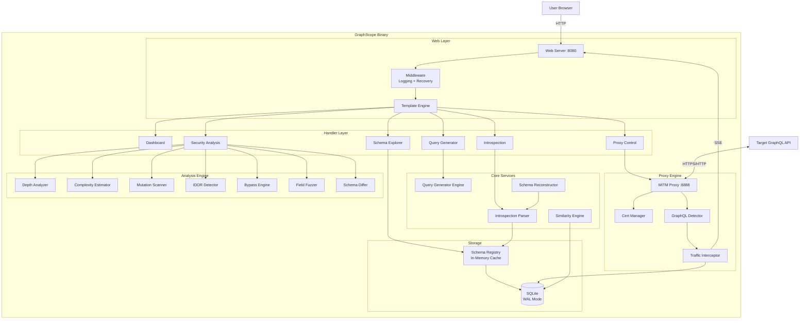
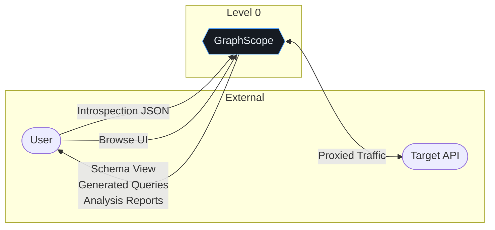
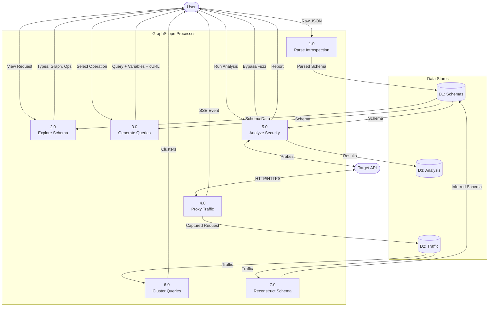
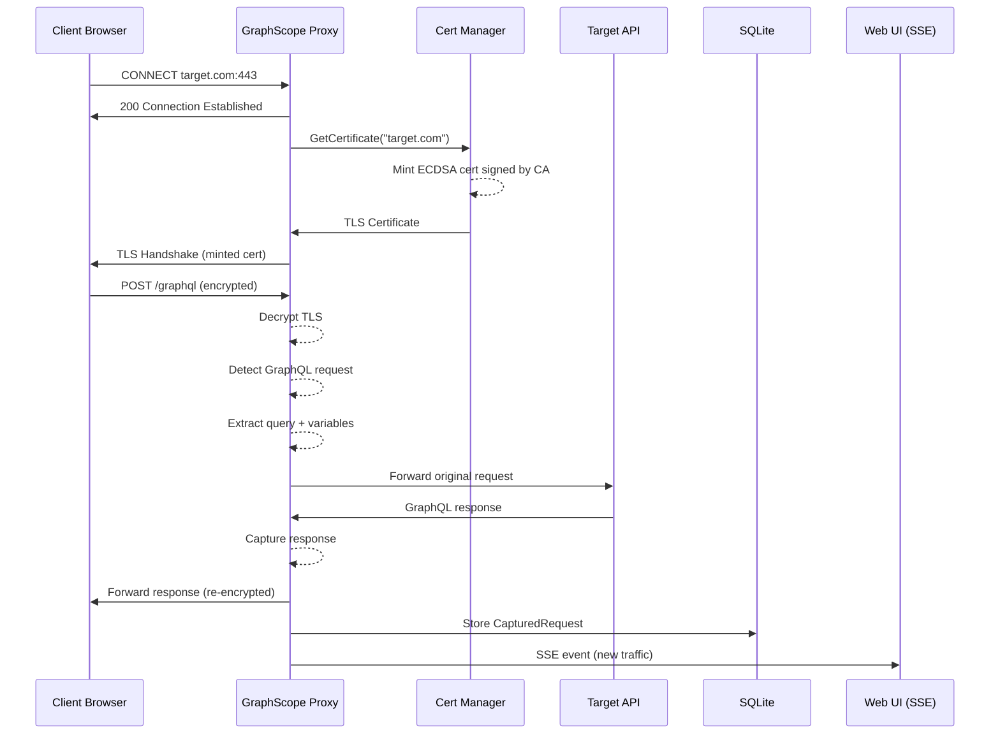
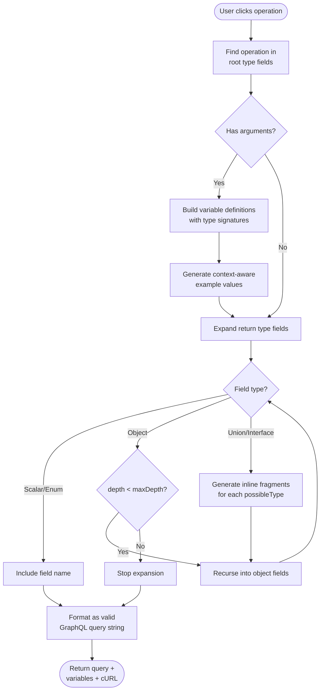
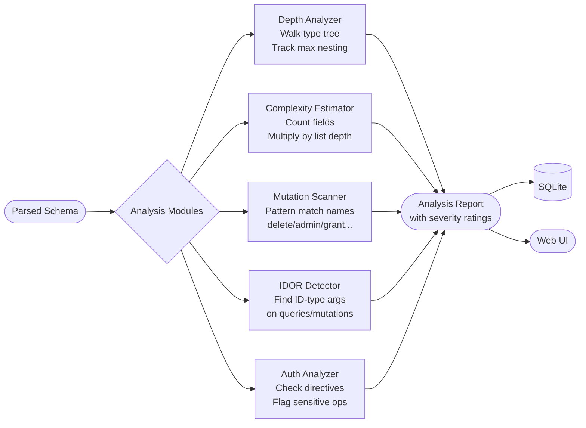

# GraphScope

A GraphQL reconnaissance and security testing tool built in Go. Single binary, zero-config, dark-themed web UI.

GraphScope provides schema introspection parsing, interactive type visualization, an MITM proxy for traffic capture, automatic query generation, similarity analysis, and security auditing — all from a single binary with an embedded web interface.

## Features

- **Introspection Parser** — Paste introspection JSON, get full schema analysis
- **Schema Visualization** — Interactive D3.js force-directed graph of type relationships
- **Query Generator** — Auto-build queries/mutations with correct arguments and example values
- **MITM Proxy** — Intercept HTTPS traffic, detect and capture GraphQL operations in real-time
- **Similarity Engine** — Fingerprint, cluster, and compare captured queries structurally
- **Schema Reconstruction** — Infer schema from traffic when introspection is disabled
- **Security Analysis** — Depth analysis, complexity scoring, IDOR detection, dangerous mutation flagging
- **Introspection Bypass** — 11 automated bypass techniques against WAF-protected endpoints
- **Field Fuzzer** — Wordlist-based field discovery via error message mining
- **Schema Diffing** — Compare schema versions, detect breaking changes and privilege escalation

## Quick Start

```bash
# Build
make build

# Run
./graphscope

# With auto-starting proxy
./graphscope -auto-proxy

# Custom ports
./graphscope -addr :9090 -proxy :9999
```

Open `http://localhost:8080` in your browser.

## Usage

### 1. Introspection Mode

Paste your introspection JSON into the dashboard. Supported formats:

```json
{"data":{"__schema":{...}}}
{"__schema":{...}}
{"queryType":{...}, "types":[...]}
```

The schema explorer will show all types, operations, and relationships.

### 2. Proxy Mode

1. Install the CA certificate from `~/.graphscope/ca.pem` into your browser/system trust store
2. Start the proxy from the UI or with `-auto-proxy`
3. Configure your browser/tool to proxy through `:8888`
4. Browse any GraphQL API — requests appear in real-time via SSE

### 3. Query Generation

Click any operation in the schema explorer or generator view. GraphScope will:

- Build a complete query with proper variable definitions
- Fill in context-aware example values (emails, IDs, pagination params)
- Expand nested return types to configurable depth
- Generate inline fragments for unions/interfaces
- Show a ready-to-use cURL command

### 4. Security Analysis

Run the full analysis suite against any parsed schema:

| Module | What It Detects |
|---|---|
| Depth Analysis | Operations with deep nesting (>7 levels) |
| Complexity Estimation | High-cost operations that could enable DoS |
| Dangerous Mutations | delete/admin/resetPassword/grant/execute patterns |
| IDOR Detection | ID-type arguments on queries and mutations |
| Auth Pattern Analysis | Missing auth directives, sensitive operations |
| Introspection Bypass | 11 techniques to bypass disabled introspection |
| Field Fuzzer | Discover valid fields via error message suggestions |
| Schema Diff | Breaking changes, new mutations, privilege escalation |

## Architecture

### System Overview



### Data Flow Diagram (DFD)



#### Level 1 DFD



### MITM Proxy Flow



### Query Generation Flow



### Security Analysis Pipeline



## Directory Structure

```
graphscope/
├── cmd/graphscope/         # Entry point, flag parsing, wiring
│   └── main.go
├── internal/
│   ├── server/             # HTTP server, stdlib router, middleware
│   ├── handler/            # Request handlers (dashboard, schema, proxy, analysis)
│   ├── parser/             # Introspection JSON parser, query parser, schema reconstruction
│   ├── schema/             # Core data models, registry, type resolver, graph builder
│   ├── generator/          # Query generation, variable examples, depth/complexity analysis
│   ├── proxy/              # MITM proxy engine, ECDSA cert manager, GraphQL detection
│   ├── similarity/         # Query fingerprinting, clustering, Jaccard similarity
│   ├── analysis/           # Security modules (mutations, IDOR, bypass, fuzzer, diff)
│   ├── storage/            # SQLite setup, migrations, repos (schema, traffic, analysis)
│   └── wordlist/           # Embedded field wordlist for fuzzing
├── web/
│   ├── embed.go            # embed.FS declarations
│   ├── templates/          # Go HTML templates + HTMX partials
│   └── static/             # CSS, JS, vendored D3.js + HTMX
├── go.mod
├── Makefile
└── README.md
```

## Tech Stack

| Component | Choice | Rationale |
|---|---|---|
| Language | Go 1.22+ | Stdlib router, single binary, goroutines |
| Web Framework | `net/http` stdlib | Zero dependencies, method routing since Go 1.22 |
| Frontend | Go templates + HTMX + D3.js | No build tooling, vendored JS, server-rendered |
| Database | SQLite (WAL mode) | Embedded, zero-config, portable |
| TLS/Crypto | `crypto/x509` + `crypto/ecdsa` | Stdlib, ECDSA P-256 for fast cert minting |
| Visualization | D3.js v7 force-directed graph | Custom schema graph, no graphql-voyager |

**External dependencies: 1** — `github.com/mattn/go-sqlite3`

Everything else is Go standard library or vendored JS.

## CLI Flags

| Flag | Default | Description |
|---|---|---|
| `-addr` | `:8080` | Web UI listen address |
| `-proxy` | `:8888` | MITM proxy listen address |
| `-db` | `~/.graphscope/graphscope.db` | SQLite database path |
| `-auto-proxy` | `false` | Start proxy automatically on launch |

## Files Generated

On first run, GraphScope creates `~/.graphscope/` containing:

| File | Purpose |
|---|---|
| `ca.pem` | CA certificate — install in browser/system trust store for HTTPS interception |
| `ca-key.pem` | CA private key (ECDSA P-256) — kept with 0600 permissions |
| `graphscope.db` | SQLite database for schemas, traffic, and analysis results |

## Security Considerations

- The MITM proxy uses `InsecureSkipVerify` when forwarding to targets — this is **by design** for a security testing tool. Do not use in production environments.
- The web UI has **no authentication**. Bind to `localhost` or use in isolated networks only.
- CA private key is stored at `~/.graphscope/ca-key.pem` with restricted permissions. Protect this file.
- The field fuzzer and bypass engine send HTTP requests to external targets. Use only against systems you are authorized to test.

## License

For authorized security testing, defensive security research, and educational use only.
