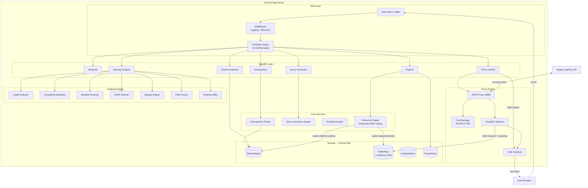
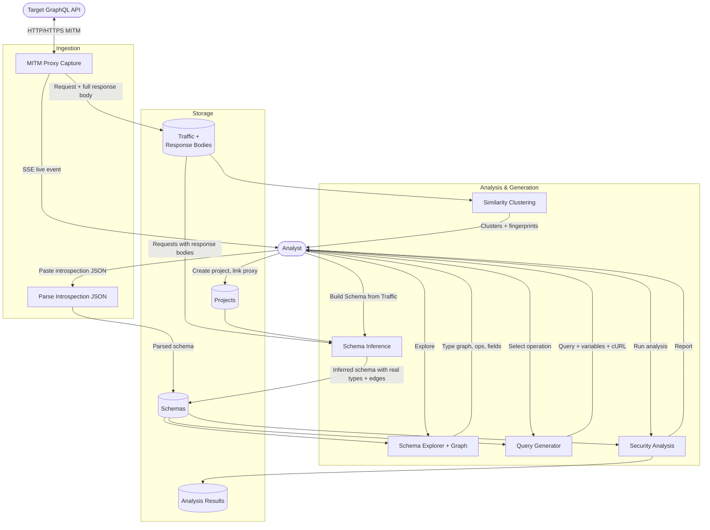
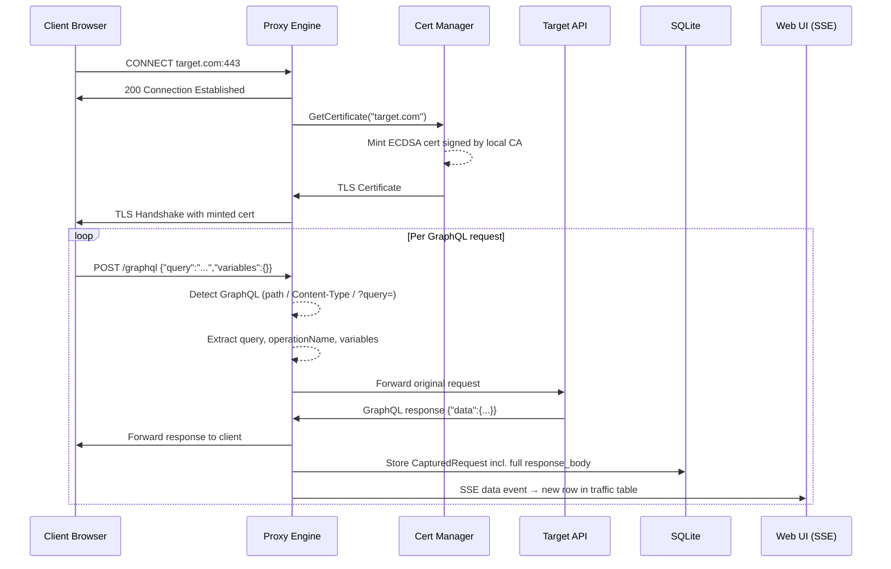
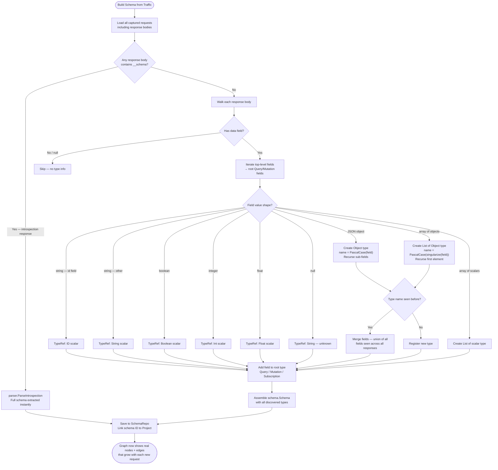
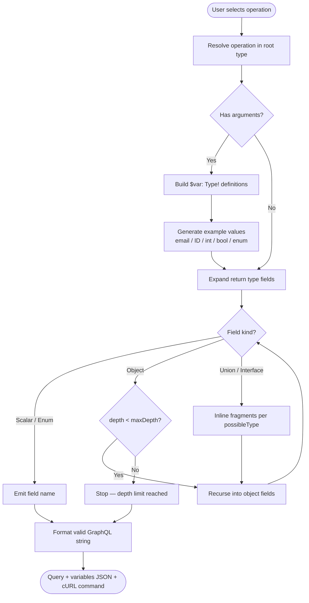
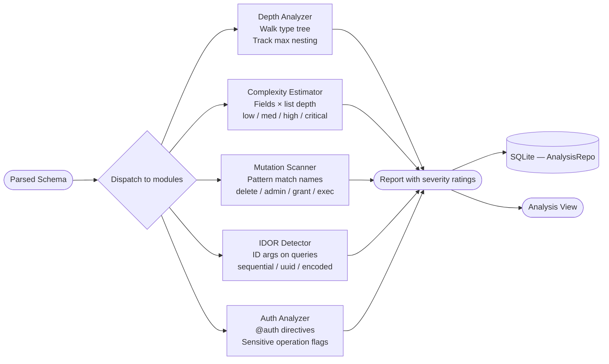

# 0xGQLForge

A GraphQL reconnaissance and security testing tool built in Go. Single binary, zero-config, dark-themed web UI.

0xGQLForge provides schema introspection parsing, interactive type visualization, an MITM proxy for traffic capture with **live schema inference from response bodies**, automatic query generation, similarity analysis, and security auditing — all from a single binary with an embedded web interface.

## Features

- **Introspection Parser** — Paste introspection JSON, get full schema analysis
- **Schema Visualization** — Interactive D3.js force-directed graph of type relationships
- **Query Generator** — Auto-build queries/mutations with correct arguments and example values
- **MITM Proxy** — Intercept HTTPS traffic, detect and capture GraphQL operations in real-time via SSE
- **Proxy Projects** — Organize captured traffic into named projects, link inferred schemas to each
- **Schema Inference** — Parse response bodies to reconstruct real object types and graph edges; auto-detect introspection responses for instant full schemas
- **Similarity Engine** — Fingerprint, cluster, and compare captured queries structurally
- **Security Analysis** — Depth analysis, complexity scoring, IDOR detection, dangerous mutation flagging
- **Introspection Bypass** — 11 automated bypass techniques against WAF-protected endpoints
- **Field Fuzzer** — Wordlist-based field discovery via error message mining
- **Schema Diffing** — Compare schema versions, detect breaking changes and privilege escalation

## Quick Start

```bash
# Build (requires CGO for SQLite)
make build

# Run with defaults (UI: :8080, Proxy: :8888)
./gqlforge

# Start proxy automatically on launch
./gqlforge -auto-proxy

# Custom ports
./gqlforge -addr :9090 -proxy :9999
```

Open `http://localhost:8080` in your browser.

## Usage

### 1. Introspection Mode

Navigate to **Schemas** (home page). Paste your introspection JSON. Supported formats:

```json
{"data":{"__schema":{...}}}
{"__schema":{...}}
{"queryType":{...}, "types":[...]}
```

The schema explorer shows all types, operations, and relationships. From there open the **Graph** (D3.js force-directed visualization) or the **Generator**.

### 2. Proxy Mode + Schema Inference

The proxy is a MITM HTTP/HTTPS interceptor. It captures only GraphQL traffic and streams it live to the UI via SSE — no page refresh needed.

**Setup:**
1. Install `~/.gqlforge/ca.pem` into your browser/system trust store
2. Go to **Proxy** in the nav bar and click **Start Proxy**
3. Configure your browser or tool to use `127.0.0.1:8888` as the proxy
4. Browse any GraphQL API — requests appear in the traffic table in real-time

**Link to a Project:**
- Create a project on the **Projects** page first
- On the **Proxy** page, select the project from the dropdown and click **Apply**
- All subsequent captured traffic is tagged to that project

**Build a Schema from Traffic:**
- Go to **Projects → [your project] → Build Schema from Traffic**
- The inference engine walks captured response bodies to discover real object types:
  - `{"data":{"user":{"id":"1","name":"Alice","posts":[...]}}}` → creates `User` and `Post` types with edges
  - `id` / `*Id` fields → `ID` scalar; booleans → `Boolean`; numbers → `Int` / `Float`
  - Arrays of objects → `[TypeName]` list references with automatic singularization
- If an introspection query was made through the proxy, the full schema is extracted automatically from the response — no manual steps needed

**Schema Grows Over Time:**
The more endpoints you browse, the richer the graph becomes. Each captured response adds new types or merges new fields into existing types.

### 3. Query Generation

Click any operation in the schema explorer or generator view. 0xGQLForge will:

- Build a complete query with proper variable definitions
- Fill in context-aware example values (emails, IDs, pagination params)
- Expand nested return types to configurable depth
- Generate inline fragments for unions/interfaces
- Show a ready-to-use cURL command

### 4. Security Analysis

Run the full analysis suite against any parsed schema:

| Module | What It Detects |
|---|---|
| Depth Analysis | Operations with deep nesting (>7 levels) |
| Complexity Estimation | High-cost operations that could enable DoS |
| Dangerous Mutations | delete/admin/resetPassword/grant/execute patterns |
| IDOR Detection | ID-type arguments on queries and mutations |
| Auth Pattern Analysis | Missing auth directives, sensitive operations |
| Introspection Bypass | 11 techniques to bypass disabled introspection |
| Field Fuzzer | Discover valid fields via error message suggestions |
| Schema Diff | Breaking changes, new mutations, privilege escalation |

---

## Architecture

### System Overview



### Data Flow



### MITM Proxy Flow



### Schema Inference Flow



### Query Generation Flow



### Security Analysis Pipeline



---

## Directory Structure

```
0xGQLForge/
├── cmd/gqlforge/
│   └── main.go                  # Entry point: flags, service wiring, graceful shutdown
├── internal/
│   ├── server/                  # HTTP server, routes.go, middleware (recovery + logging)
│   ├── handler/                 # Request handlers: schemas, proxy, projects, analysis
│   ├── parser/                  # Introspection JSON parser (3 formats), query parser
│   ├── schema/                  # Core models (Schema, Type, TypeRef, Field), graph builder
│   ├── generator/               # Query building, variable examples, depth/complexity
│   ├── proxy/                   # MITM engine, ECDSA cert minting, GraphQL detection, SSE pub/sub
│   ├── inference/               # Schema inference from response bodies; introspection auto-detect
│   ├── similarity/              # Query fingerprinting, Jaccard similarity, clustering
│   ├── analysis/                # Security modules: mutations, IDOR, bypass, fuzzer, diff
│   ├── storage/                 # SQLite WAL, migrations, repos (Schema, Traffic, Analysis, Project)
│   └── wordlist/                # Embedded field wordlist for fuzzing
├── web/
│   ├── embed.go                 # embed.FS declarations
│   ├── templates/
│   │   ├── layout.html          # Top navbar (Schemas | Projects | Proxy | theme toggle)
│   │   ├── schemas.html         # Home: schema list + introspection upload
│   │   ├── schema.html          # Schema explorer (types, operations, sidebar)
│   │   ├── graph.html           # D3.js force-directed type graph
│   │   ├── generator.html       # Query/mutation builder + cURL
│   │   ├── proxy.html           # Live traffic table (SSE) + inline filters + project link
│   │   ├── projects.html        # Project list with create/delete
│   │   ├── project_detail.html  # Per-project traffic + schema inference trigger
│   │   └── analysis.html        # Security analysis dashboard
│   └── static/
│       ├── css/app.css          # Dark theme design system
│       └── js/                  # D3.js v7, HTMX, app.js
├── go.mod
├── Makefile
└── README.md
```

---

## Tech Stack

| Component | Choice | Rationale |
|---|---|---|
| Language | Go 1.22+ | Stdlib router, single binary, goroutines for proxy concurrency |
| Web Framework | `net/http` stdlib | Method + path routing since Go 1.22, zero dependencies |
| Frontend | Go templates + HTMX + D3.js | No build tooling, server-rendered HTML, vendored JS |
| Database | SQLite (WAL mode) | Embedded, zero-config, portable, single-file persistence |
| TLS / Crypto | `crypto/x509` + `crypto/ecdsa` | ECDSA P-256, fast per-host cert minting |
| Graph Viz | D3.js v7 force-directed | Custom schema ERD with click/hover lineage highlighting |
| Live Updates | Server-Sent Events (SSE) | Lightweight server push without WebSocket overhead |

**External dependencies: 1** — `github.com/mattn/go-sqlite3` (CGO, C SQLite binding)

Everything else is Go standard library or vendored JS.

---

## CLI Flags

| Flag | Default | Description |
|---|---|---|
| `-addr` | `:8080` | Web UI listen address |
| `-proxy` | `:8888` | MITM proxy listen address |
| `-db` | `~/.gqlforge/gqlforge.db` | SQLite database path |
| `-auto-proxy` | `false` | Start proxy automatically on launch |

## Runtime Files

On first run, 0xGQLForge creates `~/.gqlforge/` containing:

| File | Purpose |
|---|---|
| `ca.pem` | CA certificate — install in browser/system trust store for HTTPS interception |
| `ca-key.pem` | CA private key (ECDSA P-256) — stored with 0600 permissions |
| `gqlforge.db` | SQLite database: schemas, traffic (incl. response bodies), projects, analysis results |

## GraphQL Request Detection

The proxy flags a request as GraphQL if **any** of these match:

| Condition | Example |
|---|---|
| URL path contains `graphql` or `gql` | `/graphql`, `/api/gql`, `/v1/graphql` |
| `GET` with `?query=` parameter | `GET /api?query={user{id}}` |
| `POST` with `Content-Type: application/json` | Any JSON POST — recorded only if `query` field is present |

Supported body shapes: single `{"query":"...","operationName":"...","variables":{}}` or batch `[{"query":"..."},...]` (first item used).

## Security Considerations

- The MITM proxy uses `InsecureSkipVerify` when forwarding to targets — **by design** for a security testing tool. Do not use in production environments.
- The web UI has **no authentication**. Bind to `localhost` or an isolated network only.
- The CA private key at `~/.gqlforge/ca-key.pem` has restricted permissions. Protect this file — anyone with it can impersonate any HTTPS site to browsers that trust your CA.
- The field fuzzer and bypass engine send HTTP requests to external targets. Use only against systems you are authorized to test.

## License

For authorized security testing, defensive security research, and educational use only.
