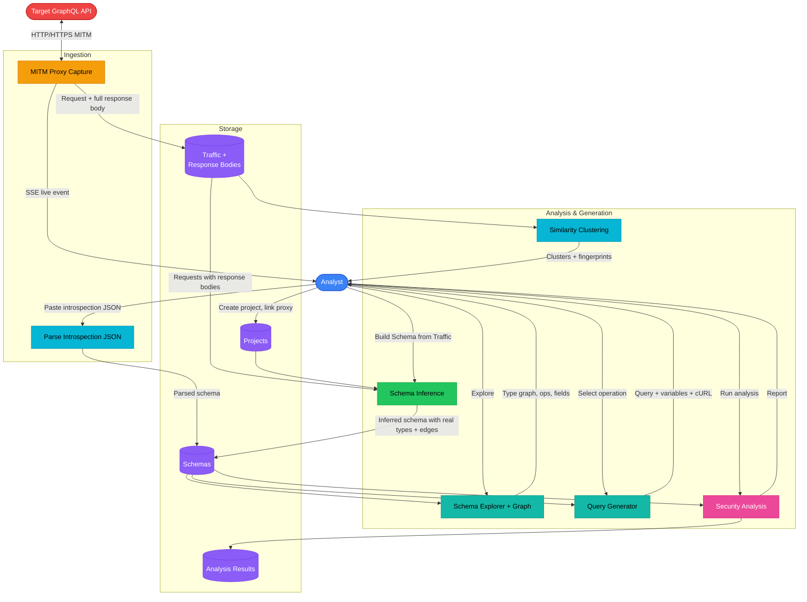
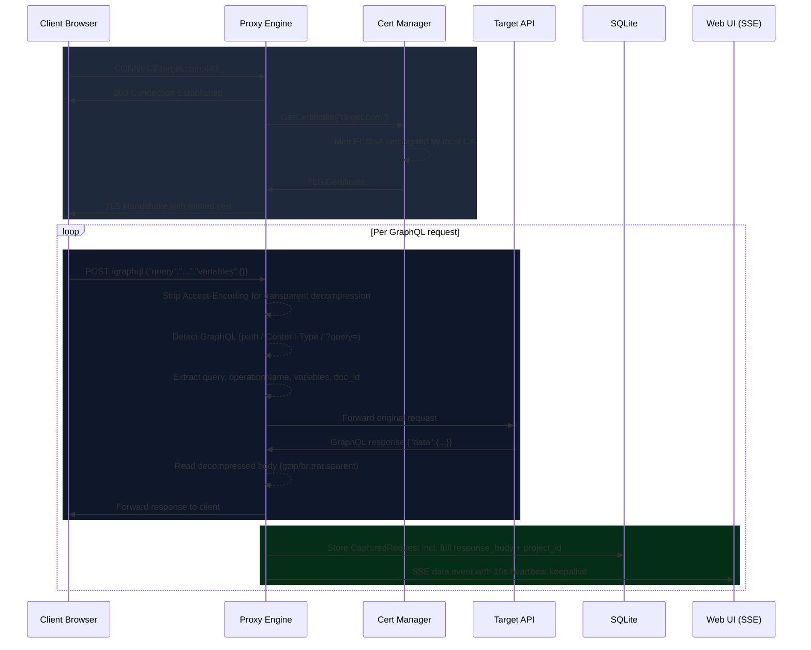
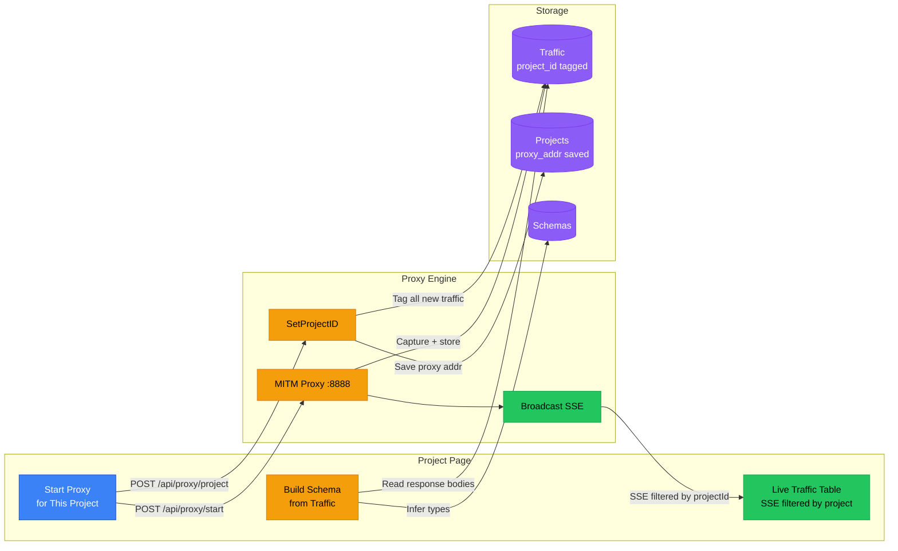
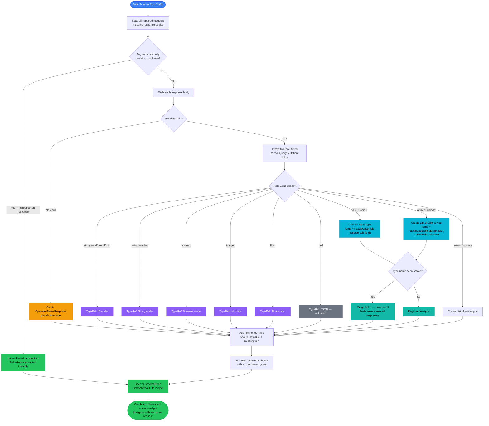
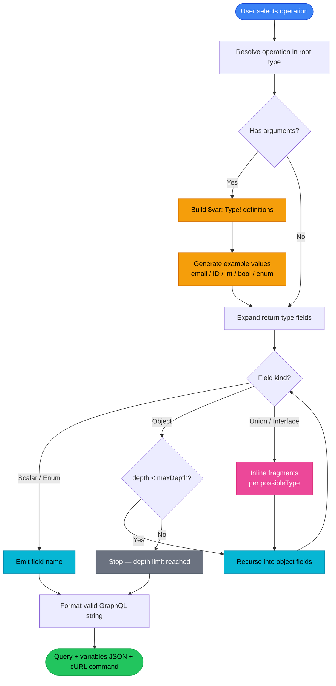
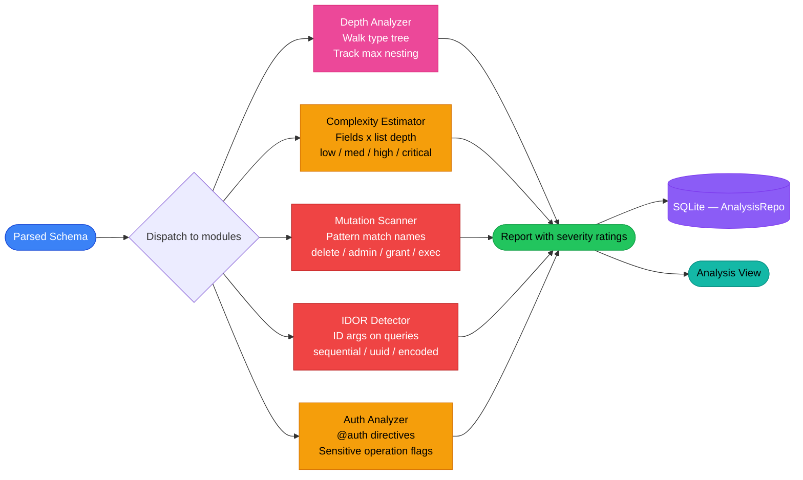
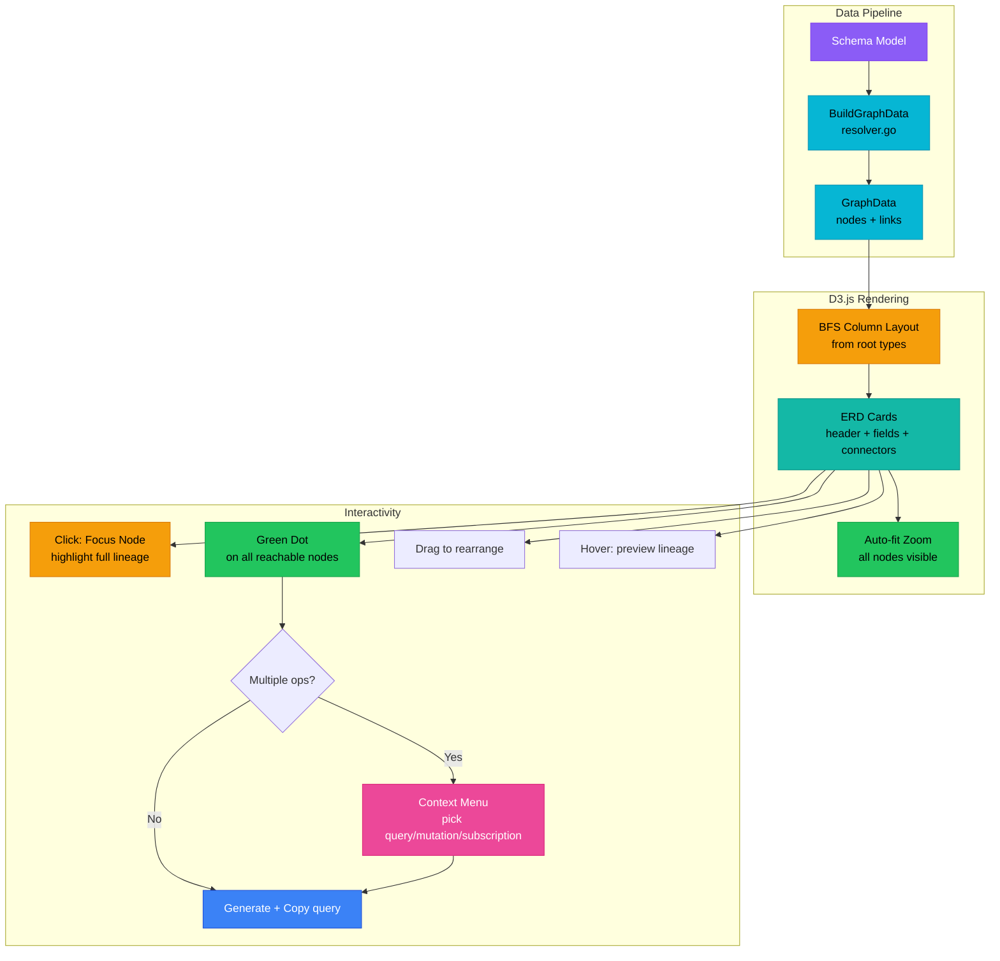

# 0xGQLForge

A GraphQL reconnaissance and security testing tool built in Go. Single binary, zero-config, dark-themed web UI.

0xGQLForge provides schema introspection parsing, interactive type visualization, an MITM proxy for traffic capture with **live schema inference from response bodies**, automatic query generation, similarity analysis, and security auditing — all from a single binary with an embedded web interface.

## Features

- **Introspection Parser** — Paste introspection JSON, get full schema analysis
- **Schema Visualization** — Interactive D3.js ERD-style graph with BFS column layout, click-to-generate queries on any node, operation picker context menu
- **Query Generator** — Auto-build queries/mutations with correct arguments, example values, and inline union/interface fragments
- **MITM Proxy** — Intercept HTTPS traffic, detect and capture GraphQL operations in real-time via SSE with automatic gzip decompression
- **Proxy Projects** — Organize captured traffic into named projects; start/stop proxy directly from project page; live-updating traffic tables via SSE
- **Schema Inference** — Parse response bodies to reconstruct real object types and graph edges; auto-detect introspection responses for instant full schemas
- **Instagram/Meta Support** — Captures form-encoded persisted queries (`doc_id`, `fb_api_req_friendly_name`) from Instagram, Facebook, and other Meta GraphQL endpoints
- **Similarity Engine** — Fingerprint, cluster, and compare captured queries structurally with stable fingerprint-based IDs
- **Security Analysis** — Depth analysis, complexity scoring, IDOR detection, dangerous mutation flagging
- **Introspection Bypass** — 11 automated bypass techniques against WAF-protected endpoints
- **Field Fuzzer** — Wordlist-based field discovery via error message mining with URL validation
- **Schema Diffing** — Compare schema versions, detect breaking changes and privilege escalation

## Quick Start

```bash
# Build (requires CGO for SQLite)
make build

# Run with defaults (UI: :8080, Proxy: :8888)
./gqlforge

# Start proxy automatically on launch
./gqlforge -auto-proxy

# Custom ports
./gqlforge -addr :9090 -proxy :9999
```

Open `http://localhost:8080` in your browser.

## Usage

### 1. Introspection Mode

Navigate to **Schemas** (home page). Paste your introspection JSON. Supported formats:

```json
{"data":{"__schema":{...}}}
{"__schema":{...}}
{"queryType":{...}, "types":[...]}
```

The schema explorer shows all types, operations, and relationships. From there open the **Graph** (D3.js ERD visualization) or the **Generator**.

### 2. Proxy Mode + Schema Inference

The proxy is a MITM HTTP/HTTPS interceptor. It captures only GraphQL traffic and streams it live to the UI via SSE — no page refresh needed.

**Setup:**
1. Install `~/.gqlforge/ca.pem` into your browser/system trust store
2. Go to **Proxy** in the nav bar and click **Start Proxy**
3. Configure your browser or tool to use `127.0.0.1:8888` as the proxy
4. Browse any GraphQL API — requests appear in the traffic table in real-time

**Project Workflow (recommended):**
1. Create a project on the **Projects** page
2. Open the project and click **Start Proxy for This Project**
3. All captured traffic is automatically tagged to that project
4. Traffic appears live on both the project detail page and the proxy page
5. Click **Build Schema from Traffic** to infer a schema from captured responses

**Supported GraphQL Formats:**
- Standard JSON POST: `{"query":"...","operationName":"...","variables":{...}}`
- Batch queries: `[{"query":"..."},{"query":"..."}]` (first item used)
- Form-encoded (Instagram/Meta): `doc_id=123&variables={}&fb_api_req_friendly_name=SomeQuery`
- GET with query params: `?query={...}&operationName=...&variables={}`

**Build a Schema from Traffic:**
- Go to **Projects → [your project] → Build Schema from Traffic**
- The inference engine walks captured response bodies to discover real object types:
  - `{"data":{"user":{"id":"1","name":"Alice","posts":[...]}}}` → creates `User` and `Post` types with edges
  - `id` / `userId` / `*_id` fields → `ID` scalar; booleans → `Boolean`; numbers → `Int` / `Float`
  - Arrays of objects → `[TypeName]` list references with automatic singularization
  - Operations with no JSON response → `OperationNameResponse` placeholder types
- If an introspection query was made through the proxy, the full schema is extracted automatically from the response

**Schema Grows Over Time:**
The more endpoints you browse, the richer the graph becomes. Each captured response adds new types or merges new fields into existing types.

### 3. Schema Graph

The interactive graph shows all schema types as ERD-style cards with:
- **BFS column layout** from root types (Query/Mutation/Subscription)
- **Auto-fit zoom** to show all nodes on initial load
- **Click-to-focus** a node to highlight its full lineage (ancestors + descendants)
- **Green dot on every reachable node** — click to generate a query. If multiple operations reach a node, a context menu lets you pick which query/mutation/subscription to generate
- **Drag nodes** to rearrange; **scroll to zoom**; **Reset Layout** to recompute

### 4. Query Generation

Click any operation in the schema explorer, generator view, or graph green dot. 0xGQLForge will:

- Build a complete query with proper variable definitions
- Fill in context-aware example values (emails, IDs, pagination params)
- Expand nested return types to configurable depth
- Generate inline fragments for unions/interfaces at consistent depth
- Show a ready-to-use cURL command

### 5. Security Analysis

Run the full analysis suite against any parsed schema:

| Module | What It Detects |
|---|---|
| Depth Analysis | Operations with deep nesting (>7 levels) |
| Complexity Estimation | High-cost operations that could enable DoS |
| Dangerous Mutations | delete/admin/resetPassword/grant/execute patterns |
| IDOR Detection | ID-type arguments on queries and mutations |
| Auth Pattern Analysis | Missing auth directives, sensitive operations |
| Introspection Bypass | 11 techniques to bypass disabled introspection |
| Field Fuzzer | Discover valid fields via error message suggestions |
| Schema Diff | Breaking changes, new mutations, privilege escalation |

---

## Architecture

### System Overview


```mermaid
graph TB
    subgraph "0xGQLForge Binary"
        direction TB

        subgraph "Web Layer"
            WS[Web Server :8080]
            MW[Middleware<br/>Logging + Recovery]
            TM[Template Engine<br/>Go html/template]
        end

        subgraph "Handler Layer"
            HSL[Schemas]
            HI[Introspection]
            HSV[Schema Explorer]
            HG[Query Generator]
            HP[Proxy Control]
            HPJ[Projects]
            HA[Security Analysis]
        end

        subgraph "Core Services"
            IP[Introspection Parser]
            QG[Query Generator Engine]
            SE[Similarity Engine]
            INF[Inference Engine<br/>Response-Body Typing]
        end

        subgraph "Proxy Engine"
            PR[MITM Proxy :8888]
            CM[Cert Manager<br/>ECDSA P-256]
            GD[GraphQL Detector]
            SSE[SSE Pub/Sub]
        end

        subgraph "Analysis Engine"
            AD[Depth Analyzer]
            AC[Complexity Estimator]
            AM[Mutation Scanner]
            AI[IDOR Detector]
            AB[Bypass Engine]
            AF[Field Fuzzer]
            ADF[Schema Differ]
        end

        subgraph "Storage — SQLite WAL"
            SR[(SchemaRepo)]
            TR[(TrafficRepo<br/>+ response_body)]
            AR[(AnalysisRepo)]
            PJR[(ProjectRepo)]
        end
    end

    U[User Browser] -->|HTTP| WS
    WS --> MW --> TM
    TM --> HSL & HI & HSV & HG & HP & HPJ & HA

    HI --> IP --> SR
    HSV --> SR
    HG --> QG
    HP --> PR
    HP -->|SSE stream| SSE
    HPJ --> PJR
    HPJ --> INF
    INF -->|reads response bodies| TR
    INF -->|saves inferred schema| SR

    HA --> AD & AC & AM & AI & AB & AF & ADF

    PR --> CM & GD
    GD -->|store request + response| TR
    GD --> SSE -->|live event| U

    T[Target GraphQL API] <-->|HTTP/HTTPS| PR

    style U fill:#3b82f6,color:#fff,stroke:#1d4ed8
    style T fill:#ef4444,color:#fff,stroke:#b91c1c
    style WS fill:#0ea5e9,color:#fff,stroke:#0284c7
    style PR fill:#f59e0b,color:#000,stroke:#d97706
    style CM fill:#f59e0b,color:#000,stroke:#d97706
    style GD fill:#f59e0b,color:#000,stroke:#d97706
    style SSE fill:#22c55e,color:#000,stroke:#16a34a
    style SR fill:#8b5cf6,color:#fff,stroke:#7c3aed
    style TR fill:#8b5cf6,color:#fff,stroke:#7c3aed
    style AR fill:#8b5cf6,color:#fff,stroke:#7c3aed
    style PJR fill:#8b5cf6,color:#fff,stroke:#7c3aed
    style IP fill:#06b6d4,color:#000,stroke:#0891b2
    style QG fill:#06b6d4,color:#000,stroke:#0891b2
    style SE fill:#06b6d4,color:#000,stroke:#0891b2
    style INF fill:#06b6d4,color:#000,stroke:#0891b2
    style AD fill:#ec4899,color:#fff,stroke:#db2777
    style AC fill:#ec4899,color:#fff,stroke:#db2777
    style AM fill:#ec4899,color:#fff,stroke:#db2777
    style AI fill:#ec4899,color:#fff,stroke:#db2777
    style AB fill:#ec4899,color:#fff,stroke:#db2777
    style AF fill:#ec4899,color:#fff,stroke:#db2777
    style ADF fill:#ec4899,color:#fff,stroke:#db2777
    style MW fill:#0ea5e9,color:#fff,stroke:#0284c7
    style TM fill:#0ea5e9,color:#fff,stroke:#0284c7
    style HSL fill:#14b8a6,color:#000,stroke:#0d9488
    style HI fill:#14b8a6,color:#000,stroke:#0d9488
    style HSV fill:#14b8a6,color:#000,stroke:#0d9488
    style HG fill:#14b8a6,color:#000,stroke:#0d9488
    style HP fill:#14b8a6,color:#000,stroke:#0d9488
    style HPJ fill:#14b8a6,color:#000,stroke:#0d9488
    style HA fill:#14b8a6,color:#000,stroke:#0d9488
```

### Data Flow


```mermaid
flowchart TB
    USER([Analyst])
    TARGET([Target GraphQL API])

    subgraph "Ingestion"
        P1[Parse Introspection JSON]
        P4[MITM Proxy Capture]
    end

    subgraph "Analysis & Generation"
        P2[Schema Explorer + Graph]
        P3[Query Generator]
        P5[Security Analysis]
        P6[Similarity Clustering]
        P7[Schema Inference]
    end

    subgraph "Storage"
        D1[(Schemas)]
        D2[(Traffic +<br/>Response Bodies)]
        D3[(Analysis Results)]
        D4[(Projects)]
    end

    USER -->|Paste introspection JSON| P1
    P1 -->|Parsed schema| D1

    USER -->|Explore| P2
    D1 --> P2
    P2 -->|Type graph, ops, fields| USER

    USER -->|Select operation| P3
    D1 --> P3
    P3 -->|Query + variables + cURL| USER

    TARGET <-->|HTTP/HTTPS MITM| P4
    P4 -->|Request + full response body| D2
    P4 -->|SSE live event| USER

    USER -->|Create project, link proxy| D4

    USER -->|Build Schema from Traffic| P7
    D2 -->|Requests with response bodies| P7
    D4 --> P7
    P7 -->|Inferred schema with real types + edges| D1

    USER -->|Run analysis| P5
    D1 --> P5
    P5 --> D3
    P5 -->|Report| USER

    D2 --> P6
    P6 -->|Clusters + fingerprints| USER

    style USER fill:#3b82f6,color:#fff,stroke:#1d4ed8
    style TARGET fill:#ef4444,color:#fff,stroke:#b91c1c
    style P1 fill:#06b6d4,color:#000,stroke:#0891b2
    style P4 fill:#f59e0b,color:#000,stroke:#d97706
    style P2 fill:#14b8a6,color:#000,stroke:#0d9488
    style P3 fill:#14b8a6,color:#000,stroke:#0d9488
    style P5 fill:#ec4899,color:#fff,stroke:#db2777
    style P6 fill:#06b6d4,color:#000,stroke:#0891b2
    style P7 fill:#22c55e,color:#000,stroke:#16a34a
    style D1 fill:#8b5cf6,color:#fff,stroke:#7c3aed
    style D2 fill:#8b5cf6,color:#fff,stroke:#7c3aed
    style D3 fill:#8b5cf6,color:#fff,stroke:#7c3aed
    style D4 fill:#8b5cf6,color:#fff,stroke:#7c3aed
```

### MITM Proxy Flow


```mermaid
sequenceDiagram
    participant C as Client Browser
    participant P as Proxy Engine
    participant CA as Cert Manager
    participant T as Target API
    participant DB as SQLite
    participant UI as Web UI (SSE)

    rect rgb(30, 41, 59)
        C->>P: CONNECT target.com:443
        P->>C: 200 Connection Established
        P->>CA: GetCertificate("target.com")
        CA-->>CA: Mint ECDSA cert signed by local CA
        CA->>P: TLS Certificate
        P->>C: TLS Handshake with minted cert
    end

    loop Per GraphQL request
        rect rgb(15, 23, 42)
            C->>P: POST /graphql {"query":"...","variables":{}}
            P-->>P: Strip Accept-Encoding for transparent decompression
            P-->>P: Detect GraphQL (path / Content-Type / ?query=)
            P-->>P: Extract query, operationName, variables, doc_id
            P->>T: Forward original request
            T->>P: GraphQL response {"data":{...}}
            P-->>P: Read decompressed body (gzip/br transparent)
            P->>C: Forward response to client
        end

        rect rgb(5, 46, 22)
            P->>DB: Store CapturedRequest incl. full response_body + project_id
            P->>UI: SSE data event with 15s heartbeat keepalive
        end
    end
```

### Project-Proxy Integration


```mermaid
flowchart LR
    subgraph "Project Page"
        PP[Start Proxy<br/>for This Project]
        PT[Live Traffic Table<br/>SSE filtered by project]
        PB[Build Schema<br/>from Traffic]
    end

    subgraph "Proxy Engine"
        PR[MITM Proxy :8888]
        PID[SetProjectID]
        BC[Broadcast SSE]
    end

    subgraph "Storage"
        TR[(Traffic<br/>project_id tagged)]
        PJ[(Projects<br/>proxy_addr saved)]
        SR[(Schemas)]
    end

    PP -->|POST /api/proxy/start| PR
    PP -->|POST /api/proxy/project| PID
    PID -->|Tag all new traffic| TR
    PID -->|Save proxy addr| PJ
    PR -->|Capture + store| TR
    PR --> BC -->|SSE filtered by projectId| PT
    PB -->|Read response bodies| TR
    PB -->|Infer types| SR

    style PP fill:#3b82f6,color:#fff,stroke:#1d4ed8
    style PT fill:#22c55e,color:#000,stroke:#16a34a
    style PB fill:#f59e0b,color:#000,stroke:#d97706
    style PR fill:#f59e0b,color:#000,stroke:#d97706
    style PID fill:#f59e0b,color:#000,stroke:#d97706
    style BC fill:#22c55e,color:#000,stroke:#16a34a
    style TR fill:#8b5cf6,color:#fff,stroke:#7c3aed
    style PJ fill:#8b5cf6,color:#fff,stroke:#7c3aed
    style SR fill:#8b5cf6,color:#fff,stroke:#7c3aed
```

### Schema Inference Flow


```mermaid
flowchart TD
    START([Build Schema from Traffic]) --> LOAD[Load all captured requests<br/>including response bodies]

    LOAD --> INTRO{Any response body<br/>contains __schema?}

    INTRO -->|Yes — introspection response| FULL[parser.ParseIntrospection<br/>Full schema extracted instantly]
    FULL --> SAVE

    INTRO -->|No| WALK[Walk each response body]

    WALK --> DATA{"Has data field?"}
    DATA -->|No / null| FALLBACK[Create OperationNameResponse<br/>placeholder type]
    DATA -->|Yes| FIELDS[Iterate top-level fields<br/>to root Query/Mutation fields]

    FIELDS --> VAL{Field value shape?}
    VAL -->|string — id/userId/*_id| IDS[TypeRef: ID scalar]
    VAL -->|string — other| STR[TypeRef: String scalar]
    VAL -->|boolean| BOOL[TypeRef: Boolean scalar]
    VAL -->|integer| INT[TypeRef: Int scalar]
    VAL -->|float| FLT[TypeRef: Float scalar]
    VAL -->|null| UNK[TypeRef: JSON — unknown]
    VAL -->|JSON object| OBJ["Create Object type<br/>name = PascalCase(field)<br/>Recurse sub-fields"]
    VAL -->|array of objects| LIST["Create List of Object type<br/>name = PascalCase(singularize(field))<br/>Recurse first element"]
    VAL -->|array of scalars| SLST[Create List of scalar type]

    OBJ & LIST --> MERGE{Type name seen before?}
    MERGE -->|Yes| MRG[Merge fields — union of all<br/>fields seen across all responses]
    MERGE -->|No| NEW[Register new type]

    IDS & STR & BOOL & INT & FLT & UNK & FALLBACK & MRG & NEW & SLST --> ROOT[Add field to root type<br/>Query / Mutation / Subscription]

    ROOT --> BUILD[Assemble schema.Schema<br/>with all discovered types]
    BUILD --> SAVE[Save to SchemaRepo<br/>Link schema ID to Project]
    SAVE --> GRAPH([Graph now shows real nodes + edges<br/>that grow with each new request])

    style START fill:#3b82f6,color:#fff,stroke:#1d4ed8
    style FULL fill:#22c55e,color:#000,stroke:#16a34a
    style SAVE fill:#22c55e,color:#000,stroke:#16a34a
    style GRAPH fill:#22c55e,color:#000,stroke:#16a34a
    style OBJ fill:#06b6d4,color:#000,stroke:#0891b2
    style LIST fill:#06b6d4,color:#000,stroke:#0891b2
    style FALLBACK fill:#f59e0b,color:#000,stroke:#d97706
    style IDS fill:#8b5cf6,color:#fff,stroke:#7c3aed
    style STR fill:#8b5cf6,color:#fff,stroke:#7c3aed
    style BOOL fill:#8b5cf6,color:#fff,stroke:#7c3aed
    style INT fill:#8b5cf6,color:#fff,stroke:#7c3aed
    style FLT fill:#8b5cf6,color:#fff,stroke:#7c3aed
    style UNK fill:#6b7280,color:#fff,stroke:#4b5563
    style MRG fill:#14b8a6,color:#000,stroke:#0d9488
    style NEW fill:#14b8a6,color:#000,stroke:#0d9488
```

### Query Generation Flow


```mermaid
flowchart TD
    START([User selects operation]) --> FIND[Resolve operation in root type]
    FIND --> ARGS{Has arguments?}

    ARGS -->|Yes| VARDEFS[Build $var: Type! definitions]
    VARDEFS --> EXAMPLES[Generate example values<br/>email / ID / int / bool / enum]
    ARGS -->|No| EXPAND

    EXAMPLES --> EXPAND[Expand return type fields]

    EXPAND --> CHECK{Field kind?}
    CHECK -->|Scalar / Enum| LEAF[Emit field name]
    CHECK -->|Object| DEPTH{depth < maxDepth?}
    CHECK -->|Union / Interface| FRAG[Inline fragments<br/>per possibleType]

    DEPTH -->|Yes| RECURSE[Recurse into object fields]
    DEPTH -->|No| STOP[Stop — depth limit reached]

    FRAG --> RECURSE
    RECURSE --> CHECK
    LEAF --> FORMAT[Format valid GraphQL string]
    STOP --> FORMAT
    FORMAT --> OUTPUT([Query + variables JSON + cURL command])

    style START fill:#3b82f6,color:#fff,stroke:#1d4ed8
    style OUTPUT fill:#22c55e,color:#000,stroke:#16a34a
    style VARDEFS fill:#f59e0b,color:#000,stroke:#d97706
    style EXAMPLES fill:#f59e0b,color:#000,stroke:#d97706
    style LEAF fill:#06b6d4,color:#000,stroke:#0891b2
    style FRAG fill:#ec4899,color:#fff,stroke:#db2777
    style RECURSE fill:#06b6d4,color:#000,stroke:#0891b2
    style STOP fill:#6b7280,color:#fff,stroke:#4b5563
```

### Security Analysis Pipeline


```mermaid
flowchart LR
    SCHEMA([Parsed Schema]) --> SPLIT{Dispatch to modules}

    SPLIT --> DEPTH[Depth Analyzer<br/>Walk type tree<br/>Track max nesting]
    SPLIT --> COMPLEX[Complexity Estimator<br/>Fields x list depth<br/>low / med / high / critical]
    SPLIT --> MUTANT[Mutation Scanner<br/>Pattern match names<br/>delete / admin / grant / exec]
    SPLIT --> IDOR[IDOR Detector<br/>ID args on queries<br/>sequential / uuid / encoded]
    SPLIT --> AUTH[Auth Analyzer<br/>@auth directives<br/>Sensitive operation flags]

    DEPTH & COMPLEX & MUTANT & IDOR & AUTH --> RESULTS([Report with severity ratings])
    RESULTS --> DB[(SQLite — AnalysisRepo)]
    RESULTS --> UI([Analysis View])

    style SCHEMA fill:#3b82f6,color:#fff,stroke:#1d4ed8
    style DEPTH fill:#ec4899,color:#fff,stroke:#db2777
    style COMPLEX fill:#f59e0b,color:#000,stroke:#d97706
    style MUTANT fill:#ef4444,color:#fff,stroke:#b91c1c
    style IDOR fill:#ef4444,color:#fff,stroke:#b91c1c
    style AUTH fill:#f59e0b,color:#000,stroke:#d97706
    style RESULTS fill:#22c55e,color:#000,stroke:#16a34a
    style DB fill:#8b5cf6,color:#fff,stroke:#7c3aed
    style UI fill:#14b8a6,color:#000,stroke:#0d9488
```

### Graph Visualization Architecture


```mermaid
flowchart TD
    subgraph "Data Pipeline"
        S[Schema Model] --> BG[BuildGraphData<br/>resolver.go]
        BG --> GD[GraphData<br/>nodes + links]
    end

    subgraph "D3.js Rendering"
        GD --> BFS[BFS Column Layout<br/>from root types]
        BFS --> CARDS[ERD Cards<br/>header + fields + connectors]
        CARDS --> ZOOM[Auto-fit Zoom<br/>all nodes visible]
    end

    subgraph "Interactivity"
        CARDS --> FOCUS[Click: Focus Node<br/>highlight full lineage]
        CARDS --> GREEN[Green Dot<br/>on all reachable nodes]
        GREEN --> PICK{Multiple ops?}
        PICK -->|Yes| MENU[Context Menu<br/>pick query/mutation/subscription]
        PICK -->|No| GEN[Generate + Copy query]
        MENU --> GEN
        CARDS --> DRAG[Drag to rearrange]
        CARDS --> HOVER[Hover: preview lineage]
    end

    style S fill:#8b5cf6,color:#fff,stroke:#7c3aed
    style BG fill:#06b6d4,color:#000,stroke:#0891b2
    style GD fill:#06b6d4,color:#000,stroke:#0891b2
    style BFS fill:#f59e0b,color:#000,stroke:#d97706
    style CARDS fill:#14b8a6,color:#000,stroke:#0d9488
    style ZOOM fill:#22c55e,color:#000,stroke:#16a34a
    style GREEN fill:#22c55e,color:#000,stroke:#16a34a
    style GEN fill:#3b82f6,color:#fff,stroke:#1d4ed8
    style MENU fill:#ec4899,color:#fff,stroke:#db2777
    style FOCUS fill:#f59e0b,color:#000,stroke:#d97706
```

---

## Directory Structure

```
0xGQLForge/
├── cmd/gqlforge/
│   └── main.go                  # Entry point: flags, service wiring, graceful shutdown
├── internal/
│   ├── server/                  # HTTP server, routes.go, middleware (recovery + logging + SSE flush)
│   ├── handler/                 # Request handlers: schemas, proxy, projects, analysis
│   ├── parser/                  # Introspection JSON parser (3 formats), query parser
│   ├── schema/                  # Core models (Schema, Type, TypeRef, Field), graph builder
│   ├── generator/               # Query building, variable examples, depth/complexity
│   ├── proxy/                   # MITM engine, ECDSA cert minting, GraphQL detection, SSE pub/sub
│   ├── inference/               # Schema inference from response bodies; introspection auto-detect
│   ├── similarity/              # Query fingerprinting, Jaccard similarity, clustering
│   ├── analysis/                # Security modules: mutations, IDOR, bypass, fuzzer, diff
│   ├── storage/                 # SQLite WAL, migrations, repos (Schema, Traffic, Analysis, Project)
│   └── wordlist/                # Embedded field wordlist for fuzzing
├── web/
│   ├── embed.go                 # embed.FS declarations
│   ├── templates/
│   │   ├── layout.html          # Top navbar (Schemas | Projects | Proxy | theme toggle)
│   │   ├── schemas.html         # Home: schema list + introspection upload
│   │   ├── schema.html          # Schema explorer (types, operations, sidebar)
│   │   ├── graph.html           # D3.js ERD-style type graph with BFS layout
│   │   ├── generator.html       # Query/mutation builder + cURL
│   │   ├── proxy.html           # Live traffic table (SSE) + filters + project link
│   │   ├── projects.html        # Project list with create/delete
│   │   ├── project_detail.html  # Per-project traffic (SSE live) + proxy controls + schema inference
│   │   └── analysis.html        # Security analysis dashboard
│   └── static/
│       ├── css/app.css          # Dark theme design system
│       └── js/                  # D3.js v7, HTMX, graph.js, app.js
├── go.mod
├── Makefile
└── README.md
```

---

## Tech Stack

| Component | Choice | Rationale |
|---|---|---|
| Language | Go 1.22+ | Stdlib router, single binary, goroutines for proxy concurrency |
| Web Framework | `net/http` stdlib | Method + path routing since Go 1.22, zero dependencies |
| Frontend | Go templates + HTMX + D3.js | No build tooling, server-rendered HTML, vendored JS |
| Database | SQLite (WAL mode) | Embedded, zero-config, portable, single-file persistence |
| TLS / Crypto | `crypto/x509` + `crypto/ecdsa` | ECDSA P-256, fast per-host cert minting with dedup |
| Graph Viz | D3.js v7 | Custom ERD cards with BFS layout, lineage highlighting, operation picker |
| Live Updates | Server-Sent Events (SSE) | Lightweight server push with 15s heartbeat keepalive |

**External dependencies: 1** — `github.com/mattn/go-sqlite3` (CGO, C SQLite binding)

Everything else is Go standard library or vendored JS.

---

## CLI Flags

| Flag | Default | Description |
|---|---|---|
| `-addr` | `:8080` | Web UI listen address |
| `-proxy` | `:8888` | MITM proxy listen address |
| `-db` | `~/.gqlforge/gqlforge.db` | SQLite database path |
| `-auto-proxy` | `false` | Start proxy automatically on launch |

## Runtime Files

On first run, 0xGQLForge creates `~/.gqlforge/` containing:

| File | Purpose |
|---|---|
| `ca.pem` | CA certificate — install in browser/system trust store for HTTPS interception |
| `ca-key.pem` | CA private key (ECDSA P-256) — stored with 0600 permissions |
| `gqlforge.db` | SQLite database: schemas, traffic (incl. response bodies), projects, analysis results |

## GraphQL Request Detection

The proxy flags a request as GraphQL if **any** of these match:

| Condition | Example |
|---|---|
| URL path contains `graphql` or `gql` | `/graphql`, `/api/gql`, `/v1/graphql` |
| `GET` with `?query=` parameter | `GET /api?query={user{id}}` |
| `POST` with JSON or form-encoded body | Standard JSON or `doc_id`/`query_hash` form fields |

Supported body shapes:
- Single: `{"query":"...","operationName":"...","variables":{}}`
- Batch: `[{"query":"..."},{"query":"..."}]` (first item used)
- Form-encoded: `doc_id=123&variables={}&fb_api_req_friendly_name=SomeQuery`

## Security Considerations

- The MITM proxy uses `InsecureSkipVerify` when forwarding to targets — **by design** for a security testing tool. Do not use in production environments.
- The web UI has **no authentication**. Bind to `localhost` or an isolated network only.
- The CA private key at `~/.gqlforge/ca-key.pem` has restricted permissions. Protect this file — anyone with it can impersonate any HTTPS site to browsers that trust your CA.
- The field fuzzer and bypass engine validate target URLs (http/https only) before sending requests. Use only against systems you are authorized to test.
- All SQL queries use parameterized placeholders to prevent injection.
- Response bodies are stored decompressed (gzip/br stripped transparently) for reliable JSON parsing.

## License

For authorized security testing, defensive security research, and educational use only.
